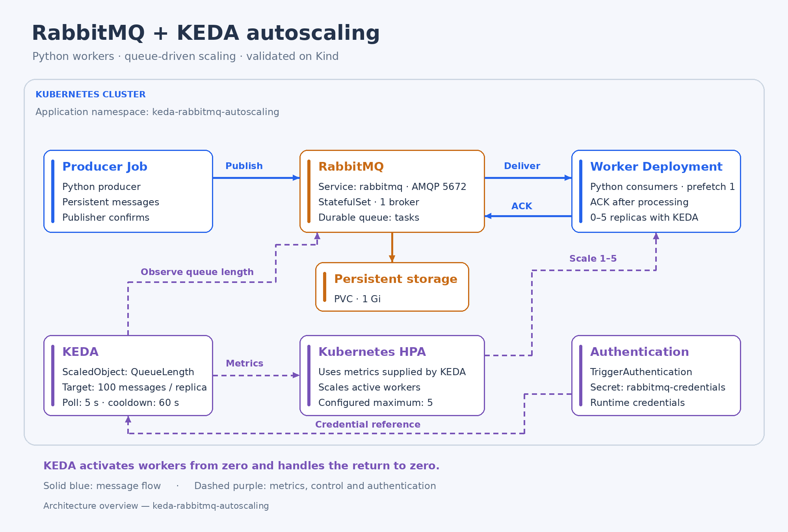

# RabbitMQ worker autoscaling with KEDA

A Kubernetes lab that scales Python consumers according to RabbitMQ queue demand, from zero to five replicas. It demonstrates message publication, acknowledgement, persistent broker storage, and the interaction between KEDA and the Kubernetes HPA.

**Validation status:** message flow and autoscaling were manually validated on Kind. Two initial 500-message runs were recorded. Fresh-cluster setup, repeated measurements, and failure recovery experiments remain pending. The CI workflow is implemented; its execution status has not been verified in this documentation review.

## Problem and approach

A fixed consumer pool can accumulate a backlog during bursts and reserve resources while idle. This project uses queue length to activate consumers and adjust their replica count as demand changes.

A Python producer publishes synthetic messages to the durable `tasks` queue. Workers simulate processing and acknowledge each message only after completion. KEDA observes ready messages over AMQP, activates the Deployment from zero, and supplies metrics to the HPA for scaling active workers.

## Architecture



The RabbitMQ broker runs as a single-replica StatefulSet with a 1 Gi PVC. Applications connect through its headless Service. Credentials are injected from a Kubernetes Secret; TriggerAuthentication references that Secret for the scaler.

See [architecture and design decisions](docs/architecture.md) for delivery behavior, scaling boundaries, and tradeoffs.

## Initial results

| Observation | Fixed worker | KEDA enabled |
| --- | --- | --- |
| Confirmed publications | 500 | 500 |
| Peak ready workers | 1 | 5 |
| Script start to reported queue completion | 16 min 48 s | 4 min 2 s |
| Return to zero | Not applicable | Observed after the workload |

The KEDA run had approximately **76% less observed elapsed time** in this pair of runs. This is a first manual comparison: runtime configuration equality was not independently captured, and the KEDA completion report did not include separate ready/unacknowledged counts. It is not a repeated benchmark or a verified throughput improvement.

The [experiment record](docs/results.md) preserves timestamps, evidence sources, calculations, and measurement limits.

## Run the lab

Required tools: Docker, Kind, kubectl, Helm, Python 3, and Bash. Use an existing Kind cluster with a working default StorageClass. The recorded cluster is `freekubelab`; Minikube has not been validated.

From the repository root, on a first setup without an existing credential Secret:

```bash
read -rp 'RabbitMQ username: ' RABBITMQ_USERNAME
read -rsp 'RabbitMQ password: ' RABBITMQ_PASSWORD
printf '\n'
export RABBITMQ_USERNAME RABBITMQ_PASSWORD

./scripts/setup.sh --cluster freekubelab --keda-version 2.21.0
unset RABBITMQ_PASSWORD
```

Setup builds and loads the application images, installs KEDA if absent, and deploys the broker, workers, and scaler. It preserves existing credentials and refuses to silently upgrade a different KEDA chart version. It does not create the cluster or publish load.

Load generation uses the current kubectl context. Select the lab explicitly before submitting work:

```bash
kubectl config use-context kind-freekubelab
./scripts/generate-load.sh 500 --dry-run
./scripts/generate-load.sh 500
```

Follow the producer logs using the command printed by the script. Watch scaling in another terminal:

```bash
kubectl --context kind-freekubelab get deployment worker-deployment \
  -n keda-rabbitmq-autoscaling -w
```

Verify both ready and unacknowledged queue counts before recording completion. For credential reuse, storage, observation commands, and cleanup, see the [operations guide](docs/operations.md).

## Scaling configuration

| Parameter | Value |
| --- | --- |
| Queue / protocol / mode | `tasks` / `amqp` / `QueueLength` |
| Queue-length target per replica | `100` |
| Minimum / maximum replicas | `0` / `5` |
| KEDA polling interval | `5 s` |
| Cooldown for return to zero | `60 s` |
| Worker prefetch / default processing delay | `1` / `2 s` |

These are lab settings. AMQP queue length represents ready messages; it does not include work already delivered and awaiting acknowledgement. HPA reconciliation, pod startup, and stabilization affect scaling. KEDA scales workers; it does not add cluster nodes.

## Engineering decisions

- **Publisher confirms and mandatory routing:** detect broker acknowledgement and unroutable publication failures.
- **Durable queue, persistent messages, and PVC:** provide persistence mechanisms whose restart behavior still requires an integration experiment.
- **Manual acknowledgements and bounded prefetch:** acknowledge completed work and limit in-flight deliveries per consumer.
- **Shutdown handling:** service heartbeats during simulated processing and leave interrupted work unacknowledged for possible redelivery.
- **Runtime credentials:** keep real credentials out of Git and image build contexts.
- **Bounded scaling and resource requests/limits:** define the lab's capacity envelope.
- **Separate load Jobs:** retain each run for inspection and disable automatic Job retries that could repeat partial publication.

## Validation and CI

The GitHub Actions workflow checks Python syntax, runs broker-free unit tests on Python 3.9 and 3.12, checks Bash syntax, and builds both Docker images. It does not deploy to Kubernetes or run an autoscaling integration test.

```bash
python -m pip install -r apps/producer/requirements.txt -r apps/worker/requirements.txt
python -m unittest discover -s tests -v
bash -n scripts/setup.sh scripts/generate-load.sh scripts/cleanup.sh
```

Tests exercise publication failures, configuration validation, credential-safe errors, acknowledgements, heartbeat servicing, shutdown interruption, and malformed payload rejection. Broker interactions are simulated; passing unit tests does not validate broker recovery or cluster behavior.

## Scope and limitations

This is a local infrastructure lab with one broker and synthetic processing. It does not implement RabbitMQ high availability, a dead-letter queue, retry backoff, application idempotency, TLS, or dedicated Kubernetes access/network policies. Duplicate processing remains possible. Malformed messages are rejected without requeue and, without a DLQ, are discarded.

The worker has no readiness probe: a Kubernetes Ready pod is not proof of an active RabbitMQ consumer. Setup and cleanup were reported as successful on the existing cluster; setup from an empty cluster with fresh storage remains unverified.

## Documentation

| Document | Purpose |
| --- | --- |
| [Architecture](docs/architecture.md) | Component responsibilities, delivery semantics, and tradeoffs |
| [Operations](docs/operations.md) | Setup, configuration, observation, troubleshooting, and cleanup |
| [Results](docs/results.md) | Recorded runs, calculations, evidence, and limitations |
| [Experiment procedure](docs/experiments.md) | Repeatable baseline and autoscaling comparison |

Repository layout: `apps/` contains Python applications and Dockerfiles; `k8s/` contains manifests; `scripts/` contains lab operations; `tests/` contains unit tests; `.github/workflows/` contains CI.

## Next steps

1. Validate setup on a fresh cluster and record exact tool, image, and chart versions.
2. Repeat paired experiments with identical runtime configuration and captured queue counts.
3. Test interrupted-worker redelivery and broker persistence across restarts.
4. Add retry/DLQ behavior and idempotent processing.
5. Add Prometheus/Grafana observations and sustained-load scenarios.

## References

- [KEDA RabbitMQ scaler](https://keda.sh/docs/2.21/scalers/rabbitmq-queue/)
- [Kubernetes HPA](https://kubernetes.io/docs/tasks/run-application/horizontal-pod-autoscale/)
- [RabbitMQ work queues](https://www.rabbitmq.com/tutorials/tutorial-two-python)
- [Kind documentation](https://kind.sigs.k8s.io/docs/user/quick-start/)
